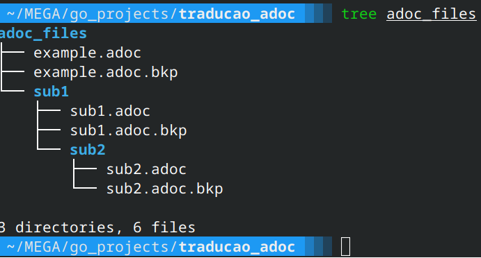

# Tradutor de Documentos AsciiDoc com IA

Um conjunto de ferramentas em Go para traduzir arquivos `.adoc` em lote usando a API do Google Gemini. Este projeto foi projetado para automatizar a tradução de documentação técnica, criando backups dos arquivos originais por segurança.

## Funcionalidades

  - **Tradução em Lote**: Processa múltiplos arquivos de uma só vez.
  - **Busca Recursiva**: Encontra arquivos `.adoc` no diretório atual e em todos os subdiretórios.
  - **Backups Automáticos**: Cria um backup (`.adoc.bkp`) de cada arquivo original antes da tradução.
  - **Preservação da Estrutura**: Os arquivos traduzidos mantêm o mesmo nome e localização dos originais.
  - **Motor de IA**: Utiliza o poder do modelo Gemini do Google para traduções de alta qualidade.

## Pré-requisitos

Antes de começar, certifique-se de que você tem os seguintes softwares instalados:

  - [Go](https://go.dev/doc/install) (versão 1.18 ou superior)
  - [Git](https://git-scm.com/downloads/)
  - Uma **Chave de API do Google Gemini**. Você pode obter uma no [Google AI Studio](https://aistudio.google.com/app/apikey).

## Instalação e Configuração

Siga estes passos para configurar o ambiente e deixar o projeto pronto para ser executado.

**1. Clone o Projeto (se estivesse em um repositório)**

Se este projeto estivesse no GitHub, você o clonaria. Por enquanto, certifique-se de que todos os arquivos `.go` estejam em um mesmo diretório.

**2. Navegue até o Diretório do Projeto**

Abra seu terminal e acesse a pasta onde seus arquivos `tradutor_lote.go` e `tradutor.go` estão localizados.

```bash
cd /caminho/para/seu/projeto
```

**3. Inicialize os Módulos do Go**

Este comando cria um arquivo `go.mod` para gerenciar as dependências do projeto.

```bash
go mod init tradutor-adoc
```

*(Você pode usar qualquer nome no lugar de `tradutor-adoc`)*

**4. Instale as Dependências**

O Go irá baixar e instalar a biblioteca necessária para interagir com a API do Gemini.

```bash
go get google.golang.org/genai
```

**5. Configure a Chave de API**

O programa lê a chave de API de uma variável de ambiente chamada `GOOGLE_API_KEY`. Você **precisa** configurar esta variável.

### Para Linux / macOS

**Opção A: Temporária (para a sessão atual do terminal)**

```bash
export GOOGLE_API_KEY="SUA_CHAVE_API_AQUI"
```

**Opção B: Permanente (recomendado)**
Adicione a linha acima ao seu arquivo de configuração do shell (`~/.bashrc`, `~/.zshrc`, etc.) e reinicie o terminal ou execute `source ~/.bashrc`.

### Para Windows

**Opção A: Temporária (para a sessão atual do Prompt de Comando)**

```cmd
set GOOGLE_API_KEY="SUA_CHAVE_API_AQUI"
```

**Opção B: Permanente (recomendado)**

1.  Pesquise por "Editar as variáveis de ambiente do sistema" no menu Iniciar.
2.  Clique em "Variáveis de Ambiente...".
3.  Em "Variáveis de usuário", clique em "Novo...".
4.  **Nome da variável:** `GOOGLE_API_KEY`
5.  **Valor da variável:** `SUA_CHAVE_API_AQUI`
6.  Clique em OK em todas as janelas e **reinicie o terminal**.

## Como Usar

O script principal para tradução em lote é o `tradutor_lote.go`.

1.  Certifique-se de que você está no diretório raiz do projeto.

2.  Coloque os arquivos `.adoc` que deseja traduzir dentro deste diretório ou em qualquer subdiretório.

3.  Execute o programa com o seguinte comando:

    ```bash
    go run tradutor_lote.go
    ```

### O que acontece durante a execução?

O script irá:

1.  Procurar por todos os arquivos `.adoc` recursivamente.
2.  Para cada arquivo, ele exibirá o progresso no terminal:
      - `--- Processando arquivo: docs/capitulo1.adoc ---`
      - `   -> Backup criado: docs/capitulo1.adoc.bkp `
      - `   -> Enviando para tradução... `
      - `   -> Tradução salva com sucesso em: docs/capitulo1.adoc `
3.  Ao final do processo, você terá os arquivos originais com o conteúdo traduzido e os backups com a extensão `.bkp`.

#### Exemplo de Estrutura de Arquivos

**Antes:**

```
.
├── docs/
│   └── capitulo1.adoc
├── introducao.adoc
└── tradutor_lote.go
```

**Depois:**

```
.
├── docs/
│   ├── capitulo1.adoc        <-- (CONTEÚDO TRADUZIDO)
│   └── capitulo1.adoc.bkp    <-- (CONTEÚDO ORIGINAL)
├── introducao.adoc           <-- (CONTEÚDO TRADUZIDO)
├── introducao.adoc.bkp       <-- (CONTEÚDO ORIGINAL)
└── tradutor_lote.go
```

## Estrutura do Projeto

  - `tradutor_lote.go`: Script principal para tradução em lote recursiva com sistema de backup.
  - `tradutor.go`: Uma versão mais simples do script que traduz um único arquivo e o salva em um diretório `traducoes/`.
  - `go.mod` e `go.sum`: Arquivos gerados pelo Go para gerenciamento de dependências.
  - `README.md`: Este arquivo.

  ### Assista à Demonstração Completa

[](https://www.youtube.com/watch?v=luGjJcAXV88)